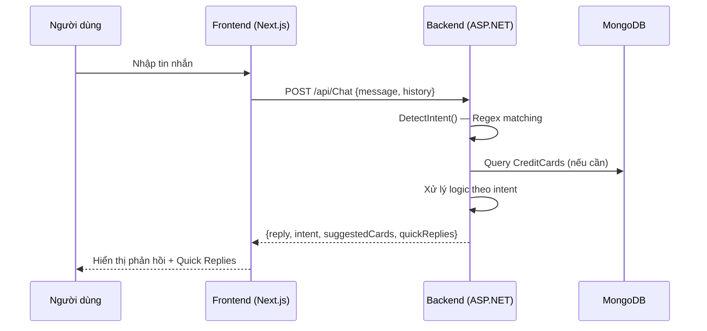
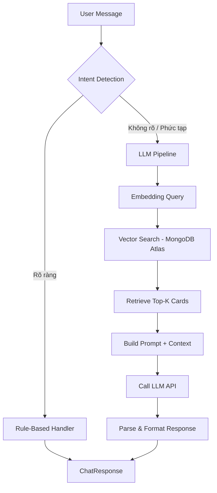
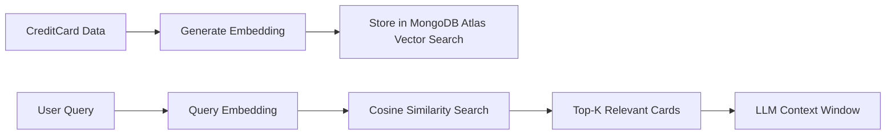
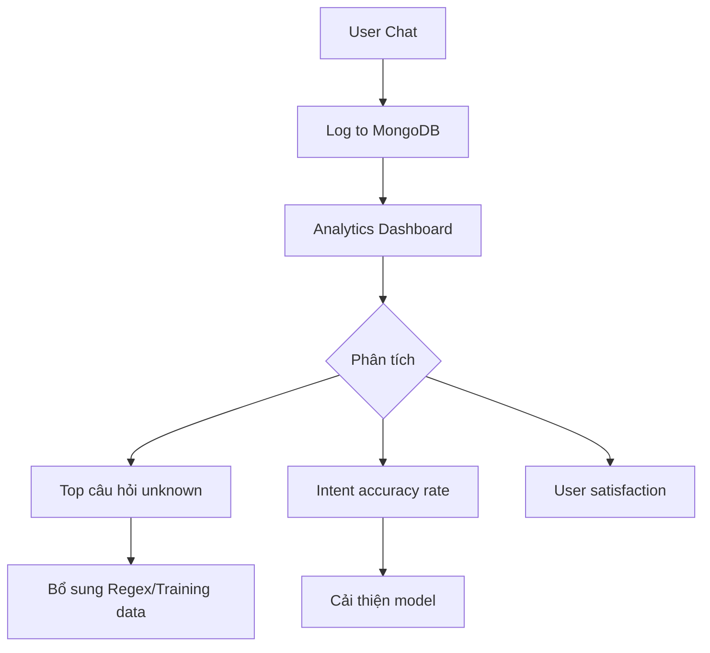

# Tài liệu Module Chatbot AI — Hệ thống CredBack

## 1. Tổng quan kiến trúc hiện tại

### 1.1. Mô hình hoạt động

Chatbot AI hiện tại sử dụng kiến trúc **Rule-Based (dựa trên luật)**, không sử dụng LLM bên ngoài (GPT, Gemini...). Toàn bộ logic xử lý ngôn ngữ tự nhiên được viết bằng C# trên backend.



### 1.2. Luồng dữ liệu chi tiết

```
User Input → ChatbotWidget.tsx → chatApi.sendMessage() → POST /api/Chat
                                                              ↓
                                              ChatController.Chat()
                                                              ↓
                                              ChatService.ProcessMessageAsync()
                                                    ↓                 ↓
                                          DetectIntent()        Query CreditCards DB
                                          (Regex match)              ↓
                                                    ↓          Lọc/Score/Rank thẻ
                                          Switch → Handler           ↓
                                                    ↓          Format response text
                                          ChatResponse {reply, intent, suggestedCards, quickReplies}
                                                              ↓
                                              Return JSON → Frontend render
```

---

## 2. Chi tiết Backend

### 2.1. Các file liên quan

| File | Vai trò |
|:---|:---|
| `Controllers/ChatController.cs` | API endpoint `POST /api/Chat`, nhận request và trả response |
| `Services/ChatService.cs` | **Core logic**: phát hiện intent, xử lý từng loại câu hỏi, format response |
| `Services/ID3Service.cs` | Thuật toán ID3 Decision Tree dùng cho gợi ý thẻ tín dụng |
| `Controllers/RecommendationController.cs` | API endpoint riêng `POST /api/Recommendation` cho ID3 |

### 2.2. Hệ thống phát hiện Intent (DetectIntent)

Chatbot sử dụng **Regex pattern matching** để phân loại ý định người dùng. Hiện tại hỗ trợ **11 intent**:

| Intent | Regex Pattern (tiếng Việt + Anh) | Handler |
|:---|:---|:---|
| `greeting` | xin chào, hello, hi, hey... | `HandleGreeting()` |
| `recommend` | gợi ý, tư vấn, nên dùng, thẻ nào phù hợp... | `HandleRecommendation()` |
| `compare` | so sánh, compare, khác nhau, vs... | `HandleCompare()` |
| `card_info` | thông tin, chi tiết, info, về thẻ... | `HandleCardInfo()` |
| `bank_search` | tên ngân hàng (vib, hsbc, techcombank...) | `HandleBankSearch()` |
| `cashback` | hoàn tiền, cashback, tích điểm, %... | `HandleCashback()` |
| `salary` | lương, salary, thu nhập, triệu/tháng... | `HandleSalary()` |
| `annual_fee` | phí, thường niên, miễn phí, free... | `HandleAnnualFee()` |
| `top_cards` | top, tốt nhất, best, xếp hạng... | `HandleTopCards()` |
| `count` | bao nhiêu, có mấy, số lượng, tổng... | `HandleCount()` |
| `help` | help, trợ giúp, hướng dẫn... | `HandleHelp()` |
| `unknown` | Không khớp pattern nào | `HandleFallback()` |

### 2.3. Thuật toán ID3 (Decision Tree)

Hệ thống gợi ý thẻ dựa trên cây quyết định ID3 đơn giản với **4 nhánh (features)**:

```
                          [Lương User]
                         /            \
                   [Đủ điều kiện]    [Loại bỏ]
                        |
                [Category Matching]
               /        |         \
        [Exact]    [Synonym]    [All/Tất cả]
        Score×10   Score×10     Score×2
                        |
                [Salary Bracket]
               /        |         \
        [1.0-1.5×]  [1.5-3.0×]  [>3.0×]
         +40 pts     +20 pts     +5 pts
                        |
                [Income vs Fee]
               /                  \
        [High + Fee>1M]     [Low + Fee=0]
          +50 pts              +30 pts
                        |
                [Credit Score]
                     |
              [Excellent] → +20 pts
```

**Scoring Weights:**
- Category match (trọng số cao nhất): `Percentage × 10`
- Salary bracket fit: +5 đến +40 điểm
- Income-Fee match: +30 đến +50 điểm
- Credit score bonus: +20 điểm

### 2.4. Request / Response Models

**ChatRequest:**
```csharp
public class ChatRequest
{
    public string Message { get; set; }           // Tin nhắn người dùng
    public List<ChatMessage> History { get; set; } // 6 tin nhắn gần nhất
}
```

**ChatResponse:**
```csharp
public class ChatResponse
{
    public string Reply { get; set; }              // Nội dung phản hồi (Markdown)
    public string Intent { get; set; }             // Intent đã phát hiện
    public List<CreditCard>? SuggestedCards { get; set; } // Thẻ gợi ý (nếu có)
    public List<string>? QuickReplies { get; set; } // Gợi ý nhanh cho user
}
```

---

## 3. Chi tiết Frontend

### 3.1. Component: `ChatbotWidget.tsx`

| Tính năng | Mô tả |
|:---|:---|
| **Floating Button** | Icon robot SVG custom, animation float + pulse |
| **Chat Panel** | Panel 400×560px, slide-up animation |
| **Quick Replies** | Nút gợi ý nhanh dưới mỗi tin nhắn bot |
| **Markdown Rendering** | Hỗ trợ bold, italic, bullet, table row |
| **Typing Indicator** | 3 dot bounce animation khi bot đang xử lý |
| **New Chat** | Reset cuộc hội thoại, hiển thị welcome message mới |
| **History Context** | Gửi 6 tin nhắn gần nhất làm context |
| **Min Delay UX** | Đảm bảo typing indicator hiển thị ≥ 800ms |

### 3.2. API Client

```typescript
chatApi.sendMessage(message: string, history: ChatMessage[])
// POST /api/Chat → { reply, intent, suggestedCards, quickReplies }
```

---

## 4. Đánh giá và Hạn chế hiện tại

### 4.1. Điểm mạnh ✅
- **Không phụ thuộc API bên ngoài**: Không tốn chi phí, không bị rate limit, không cần API key
- **Tốc độ phản hồi nhanh**: Xử lý hoàn toàn nội bộ, latency thấp
- **Dữ liệu realtime**: Query trực tiếp từ MongoDB, luôn cập nhật
- **Quick Replies**: UX tốt, hướng dẫn user đặt câu hỏi đúng

### 4.2. Hạn chế ❌
- **Không hiểu ngữ cảnh**: History được gửi nhưng **không được sử dụng** trong logic xử lý
- **Regex cứng nhắc**: Chỉ khớp các từ khóa đã định sẵn, không hiểu câu hỏi tự nhiên
- **Không có NLP thực sự**: Không phân tích ngữ nghĩa, không tokenize, không embedding
- **Fallback yếu**: Khi không khớp intent → chỉ trả "Tôi chưa hiểu rõ..."
- **Đơn ngữ giới hạn**: Regex chỉ cover một số pattern tiếng Việt + Anh cơ bản
- **Không học hỏi**: Không thu thập feedback, không cải thiện theo thời gian

---

## 5. Kế hoạch Scale & Nâng cấp

### Phase 1: Cải thiện Rule-Based (Ngắn hạn — 1-2 tuần)

#### 5.1.1. Sử dụng Conversation History
Hiện tại `History` được gửi lên nhưng bị bỏ qua. Cần bổ sung:
```csharp
// Ví dụ: Nếu user hỏi "chi tiết thẻ đó" → tìm thẻ từ tin nhắn trước
private CreditCard? ResolveCardFromHistory(List<ChatMessage> history, List<CreditCard> allCards)
{
    // Duyệt ngược history tìm tên thẻ gần nhất được đề cập
    foreach (var msg in history.AsEnumerable().Reverse())
    {
        var card = allCards.FirstOrDefault(c => msg.Content.Contains(c.Name));
        if (card != null) return card;
    }
    return null;
}
```

#### 5.1.2. Mở rộng Synonym Dictionary
Thay vì hardcode trong từng handler, tạo dictionary tập trung:
```csharp
private static readonly Dictionary<string, string[]> Synonyms = new()
{
    { "Ăn uống", new[] { "ăn", "uống", "nhà hàng", "quán ăn", "food", "dining", "restaurant", "café", "cà phê" } },
    { "Mua sắm", new[] { "mua", "shopping", "shop", "siêu thị", "thời trang" } },
    // ...
};
```

#### 5.1.3. Fuzzy Matching cho tên thẻ/ngân hàng
Thêm Levenshtein distance để khớp tên gần đúng (VD: "vipbank" → "vpbank").

---

### Phase 2: Tích hợp LLM (Trung hạn — 2-4 tuần)

#### 5.2.1. Kiến trúc Hybrid: RAG + Rule Engine



**Ý tưởng**: Giữ nguyên rule-based cho các intent đơn giản (greeting, count, help). Chỉ gọi LLM khi intent phức tạp hoặc unknown.

#### 5.2.2. Tích hợp Google Gemini API (miễn phí tier)

```csharp
// Services/GeminiService.cs
public class GeminiService
{
    private readonly HttpClient _httpClient;
    private const string API_URL = "https://generativelanguage.googleapis.com/v1beta/models/gemini-2.0-flash:generateContent";
    
    public async Task<string> GenerateResponseAsync(string userMessage, string cardContext)
    {
        var systemPrompt = @"
            Bạn là Trợ lý AI tư vấn thẻ tín dụng của CredBack.
            Dựa vào dữ liệu thẻ tín dụng bên dưới, hãy trả lời câu hỏi của khách hàng.
            Luôn trả lời bằng tiếng Việt, ngắn gọn, có emoji.
            
            DỮ LIỆU THẺ:
            " + cardContext;
        
        // Call Gemini API...
    }
}
```

**Chi phí**: Gemini 2.0 Flash miễn phí 15 RPM (requests/minute), đủ cho MVP.

#### 5.2.3. Caching Responses
Dùng Redis hoặc in-memory cache cho các câu hỏi phổ biến:
```
Cache Key: hash(intent + normalized_message)
TTL: 1 giờ (thẻ ít thay đổi)
```

---

### Phase 3: Scale Production (Dài hạn — 1-3 tháng)

#### 5.3.1. Vector Embedding cho thẻ tín dụng



**Lợi ích**: User hỏi "thẻ nào hoàn tiền nhiều khi đi ăn với gia đình cuối tuần" → Semantic search tìm đúng thẻ dining cashback, không cần keyword match.

#### 5.3.2. Fine-tuning / Prompt Engineering nâng cao
- Thu thập log hội thoại → tạo training dataset
- Fine-tune model nhỏ (Gemini Flash) với domain thẻ tín dụng Việt Nam
- Sử dụng Few-shot prompting với các ví dụ thực tế

#### 5.3.3. Multi-turn Conversation Memory
```csharp
public class ConversationMemory
{
    public string SessionId { get; set; }
    public List<ChatMessage> Messages { get; set; }
    public Dictionary<string, object> Context { get; set; } // extracted entities
    // Ví dụ: { "salary": 15000000, "preferred_category": "Ăn uống", "last_card": "VIB Cash Back" }
}
```

Lưu context giữa các lượt hội thoại để hiểu câu hỏi follow-up: "Thẻ đó phí bao nhiêu?" → biết "đó" là thẻ nào.

#### 5.3.4. Analytics & Feedback Loop



**Metrics cần track:**
- Tỷ lệ fallback (unknown intent) — mục tiêu < 10%
- Thời gian phản hồi trung bình — mục tiêu < 2s
- Tỷ lệ user click quick reply vs tự gõ
- Số lượt hội thoại trung bình/session

#### 5.3.5. Streaming Response (SSE)
Thay vì chờ toàn bộ response, stream từng token:
```
Frontend: EventSource('/api/Chat/stream')
Backend: Server-Sent Events (SSE)
```
→ UX giống ChatGPT, user thấy text xuất hiện dần.

---

## 6. Tổng kết lộ trình

| Phase | Thời gian | Nội dung | Độ phức tạp |
|:---|:---|:---|:---|
| **Phase 1** | 1-2 tuần | Cải thiện rule-based, sử dụng history, fuzzy match | ⭐⭐ |
| **Phase 2** | 2-4 tuần | Tích hợp Gemini API, RAG cơ bản, caching | ⭐⭐⭐ |
| **Phase 3** | 1-3 tháng | Vector search, streaming, analytics, fine-tune | ⭐⭐⭐⭐⭐ |
